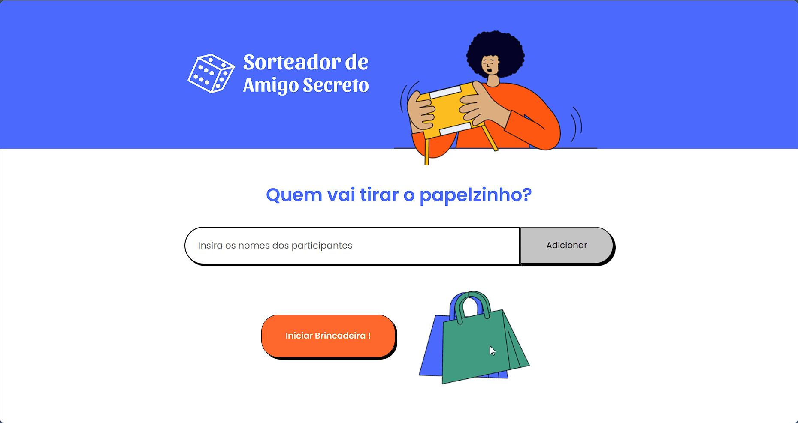

# Secret Friend 🎲

Thinking about helping with the secret friend?

### Preview

## Description

This is the secret friend project that I did as part of a guided Alura course with the oriented [Vinicios Neves](https://github.com/viniciosneves), applying knowledge of TDD (Test-Driven Development), which means test-driven development that basically focuses on clearly explaining the business rule of the project/feature you want to create using tests for different types of testing such as unit, integration, or E2E. It may seem like a somewhat bureaucratic development style, but it certainly has its benefits, such as clarifying the behavior that the code should have as well as being addictive when the test passes. ✅

## Tools

- 🎲 jest - to create the tests.
- 🎲 React with TypeScript.
- 🎲 ts-shuffle - to guess ? Shuffler the names of secret friends.

If you want, run the tests and see everything in green. run script npm run test.
